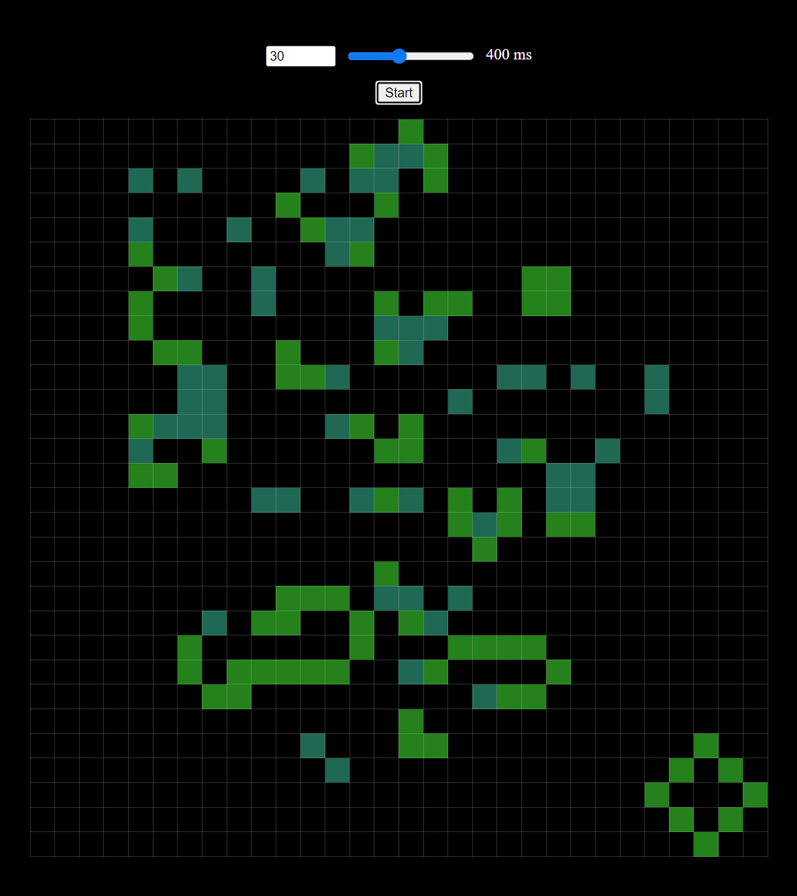

[](https://github.com/v-nvtsk/otus-jsbasic-dz24-life/actions/workflows/lint-test.yaml)  [](https://github.com/v-nvtsk/otus-jsbasic-dz24-life/actions/workflows/pages/pages-build-deployment) 

# Игра "Жизнь"

<center>  </center>

## Описание

Реализация на языке Typescript клеточного автомата ["Игра Жизнь"](https://ru.wikipedia.org/wiki/Игра_«Жизнь») , придуманного английским математиком Джоном Конвеем в 1970 году.

Игрок задает начальное состояние "клеток" и нажимает на кнопку старт.

- "Живые клетки" окрашены ярко зелёным цветом.
- Новые живые клетки появляются на пустых ячейках, если у них есть три живых соседа.
- Если соседей только два клетка остаётся живой.
- Если соседей меньше двух или больше трёх клетка погибает.
- Клетки, которые погибнут на следующем ходе окрашиваются тёмно-зелёным.

Возможно добавление новых живых ячеек в процессе игры кликом на одиночной ячейке или движением мыши при нажатой левой кнопке мыши.
В процессе игры можно менять размеры поля и скорость игры (время между ходами).

Рабочая версия проекта доступна по ссылке: [https://v-nvtsk.github.io/otus-jsbasic-dz24-life/](https://v-nvtsk.github.io/otus-jsbasic-dz24-life/)

## Детальное описание

- [x] Сборка проекта выполняется с использованием webpack. Сборку можно выполнить запуском npm скрипта:

  > npm run build

  запуск локального веб-сервера по адресу http://127.0.0.1:8080 выполняется скриптом:

  > npm start

- [x] добавлена поддержка ts файлов. Настроена транспиляция с babel
- [x] добавлена поддержка импорта css файлов в webpack
- [x] ссылку на задеплоенную страницу и на пуллреквест сбросить в чат по дз
- [x] настроить jest и написать тесты на приложение

- [x] Проверено покрытие кода тестами, проверка покрытия выполняется при деплое запуском скрипта `npm test`. Покрытие не ниже 60%

### Критерии оценки:

- [x] настроена поддержка typescript через babel - 5
- [x] реализовано приложение "Игра Жизнь" - 5 баллов
- [x] реализовано взаимодействие с полем (клик по ячейке меняет ее состояние) - 2
- [x] реализован автостоп игры, когда все клетки умерли - 2
- [x] реализован механизм изменения размеров поля (два input поля (type number)), в тч на лету (при увеличении заполнение мертвыми клетками, при уменьшении просто уничтожения ячеек) - 2
- [x] реализован механизм изменения скорости игры (input type=range) - 2
- [x] реализована подсветка клеток, которые являясь живыми должны умереть в следующем поколении (мертвые - чёрный цвет, живые - зелёный, обреченные на смерть - грязно-зелёный) - 2

**Задание считается принятым при 16 баллах**

## Запуск с готовыми фигурами

### Инициализация игры с "планерным ружьем Госпера"

<center>  </center>

Для запуска игры с полем инициализированным ружьем - необходимо заменить метод класса Game в game.js на:

```js
init(): void {
  const gliderGun = [
    [0, 0, 0, 0, 0, 0, 0, 0, 0, 0, 0, 0, 0, 0, 0, 0, 0, 0, 0, 0, 0, 0, 0, 0, 1, 0, 0, 0, 0, 0, 0, 0, 0, 0, 0, 0],
    [0, 0, 0, 0, 0, 0, 0, 0, 0, 0, 0, 0, 0, 0, 0, 0, 0, 0, 0, 0, 0, 0, 1, 0, 1, 0, 0, 0, 0, 0, 0, 0, 0, 0, 0, 0],
    [0, 0, 0, 0, 0, 0, 0, 0, 0, 0, 0, 0, 1, 1, 0, 0, 0, 0, 0, 0, 1, 1, 0, 0, 0, 0, 0, 0, 0, 0, 0, 0, 0, 0, 1, 1],
    [0, 0, 0, 0, 0, 0, 0, 0, 0, 0, 0, 1, 0, 0, 0, 1, 0, 0, 0, 0, 1, 1, 0, 0, 0, 0, 0, 0, 0, 0, 0, 0, 0, 0, 1, 1],
    [1, 1, 0, 0, 0, 0, 0, 0, 0, 0, 1, 0, 0, 0, 0, 0, 1, 0, 0, 0, 1, 1, 0, 0, 0, 0, 0, 0, 0, 0, 0, 0, 0, 0, 0, 0],
    [1, 1, 0, 0, 0, 0, 0, 0, 0, 0, 1, 0, 0, 0, 1, 0, 1, 1, 0, 0, 0, 0, 1, 0, 1, 0, 0, 0, 0, 0, 0, 0, 0, 0, 0, 0],
    [0, 0, 0, 0, 0, 0, 0, 0, 0, 0, 1, 0, 0, 0, 0, 0, 1, 0, 0, 0, 0, 0, 0, 0, 1, 0, 0, 0, 0, 0, 0, 0, 0, 0, 0, 0],
    [0, 0, 0, 0, 0, 0, 0, 0, 0, 0, 0, 1, 0, 0, 0, 1, 0, 0, 0, 0, 0, 0, 0, 0, 0, 0, 0, 0, 0, 0, 0, 0, 0, 0, 0, 0],
    [0, 0, 0, 0, 0, 0, 0, 0, 0, 0, 0, 0, 1, 1, 0, 0, 0, 0, 0, 0, 0, 0, 0, 0, 0, 0, 0, 0, 0, 0, 0, 0, 0, 0, 0, 0],
  ];

  this.size = 36;

  const { field, sizeInput, speedInput, button } = createMarkUp({
    container: this.container,
    size: this.size,
    timeInterval: this.timeInterval,
  });

  this.initControlsHandlers(sizeInput, speedInput, button);
  this.initMouseHandlers(field);

  const cells = Array.from(field.querySelectorAll(".cell"));
  gliderGun.flat().forEach((cellData, i) => {
    if (cellData === 1) (cells[i] as HTMLElement).click();
  });
}
```
